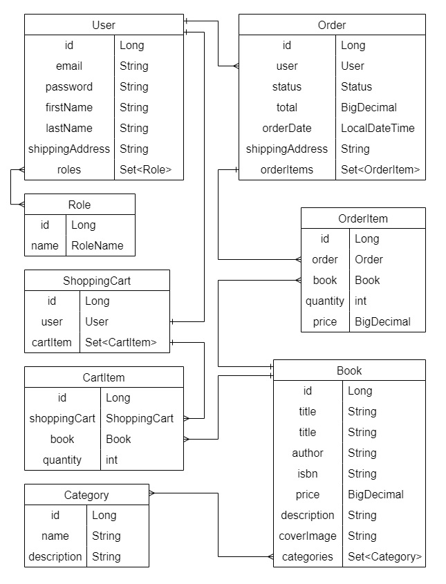

#  🏰 The Forbidden Library

## 📜 Project description:

Here you are in The Forbidden Library! Doesn't matter how did you find the way here, you are one of us now.  
Our order was founded to preserve knowledge and sharing it among the worthy. Role-based access control allows you get what you want and avoid meeting random people here. 
The literature is sorted by various categories and our efforts are aimed at simplify book searching and exploring. 
Keep improving your skills and knowledge for gaining higher access, and you will get advanced management tools for administrative tasks.  
Just enjoy...

#### The app follows a three-tier architecture by separating presentation, application, and data tiers:

* Controller: handles user interactions, including HTTP request handling and response generation; 
* Service: contains the core application logic;
* Repository: interacts with the underlying data storage.

## 🔗 Entity-Relationship Diagram

## 🛠️ Project Functionality:

User can have USER or ADMIN roles. USER role is assigned automatically to each newly registered user. One default user with role ADMIN is already added to database.  
Access types: 🟢 - unregistered user 🟡 - ADMIN role 🔴 - USER role 🟠 - ADMIN or USER roles
* AuthenticationController:
    * 🟢 login user;
    * 🟢 register new user;
* CategoryController:
  * 🟡 create a new category;
  * 🟠 get a list of all available categories;
  * 🟠 get category by id;
  * 🟡 update a category by ID;
  * 🟡 delete a category by ID;
  * 🟠 get all books with category id;
* BookController:
  * 🟠 get all books;
  * 🟠 get a book by ID;
  * 🟡 create a new book;
  * 🟡 delete a book by ID;
  * 🟡 update a book by ID;
  * 🟠 search a book by parameters;
* ShoppingCartController:
  * 🔴 add book to the cart;
  * 🔴 get all items in the cart;
  * 🔴 update book quantity;
  * 🔴 delete book from YOUR shopping cart;
* OrderController:
  * 🔴 create order;
  * 🔴 get orders history;
  * 🟡 update order status;
  * 🟠 get order by id;
  * 🟠 get special item from order by id;
  
## ⚙️ Technologies:

* JDK 17
* Maven 3.9.4
* Spring Boot Starter 3.1.2
* Spring Boot Starter Security 3.1.2
* Spring Boot Starter Data JPA 3.1.2
* PostgreSQL 16.0
* MySQL 8.0.33
* Liquibase 4.20.0
* Lombok 1.18.28
* Mapstruct 1.5.5
* JWT 0.11.5
* Docker 24.0.6

## 🗃️ Project structure:

#### [intro/src/main/java/mate.academy.intro/](src/main/java/mate/academy/intro)
* [config](src/main/java/mate/academy/intro/config) - configuration classes for mapper and security
* [controller](src/main/java/mate/academy/intro/controller) - http controllers
* [dto](src/main/java/mate/academy/intro/dto) - classes for providing information in http requests and responses
* [exception](src/main/java/mate/academy/intro/exception) - global exception handler and custom exceptions
* [mapper](src/main/java/mate/academy/intro/mapper) - classes for map entities
* [model](src/main/java/mate/academy/intro/model) - entity classes used in the application
* [repository](src/main/java/mate/academy/intro/repository) - classes for CRUD operation with database
* [security](src/main/java/mate/academy/intro/security) - classes for provide security
* [service](src/main/java/mate/academy/intro/service) - classes that provide business logic

#### [resources/](src/main/resources)
* [changelog](src/main/resources) - files for manage database with liquibase
* [application.properties](src/main/resources) - contains application configuration
* [liquibase.properties](src/main/resources) - contains liquibase properties

#### [intro/src/test/java/mate/academy/intro](src/test/java/mate/academy/intro)
* [config](src/test/java/mate/academy/intro/config) - configuration class for test user
* [controller](src/test/java/mate/academy/intro/controller) - test classes for controllers
* [service](src/test/java/mate/academy/intro/service) - test classes for services

#### [intro/src/test/resources](src/test/resources)
* [database](src/test/resources/database) - folder with SQL scripts for testing controllers
* [application.properties](src/test/resources/application.properties) - contains testing app properties 

#### other files
* [pom.xml](pom.xml) - contains maven configuration
* [checkstyle.xml](checkstyle.xml) - contains checkstyle rules
* [Dockerfile](Dockerfile) - configuration for docker
* [docker-compose.yml](docker-compose.yaml) - this file is used with Docker Compose to define multi-container applications. It specifies the services, networks, and volumes required for running the application, along with any environment variables.

## 🕹️ How to run the project locally:
* Ensure you have Docker installed on your system.
* Configure your database settings in the .env file.
* Open a terminal and navigate to the root directory of your project.
* Run the application using Docker Compose: docker-compose up
* Explore the endpoints using tools like Postman or Swagger

## 🎞️ Brief demonstration
[Short video](images/brief_demo.mp4)